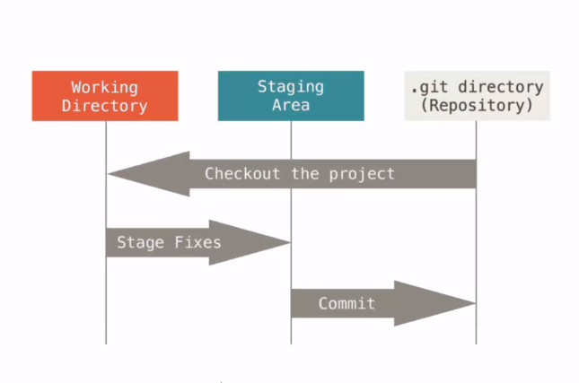

# Git & Github

## 1. Git 을 이용한 버전관리

### Git : 분산 버전 관리 프로그램 

---

- **버전**: 컴퓨터 소프트웨어의 특정 상태
- **관리**: 어떤 일의 사무, 시설이나 물건의 유지 개량
- **프로그램**: 컴퓨터에서 실행될 때 특정 작업을 수행하는 일련의 명령어들 모음

- **버전관리**: 컴퓨터 소프트웨어의 특정 상태들을 관리하는 것

  - 일반적인 버전관리의 어려움

    - 무엇이 가장 최근 것인지 알기 어려움
    - 버전 별로 변경사항이 무엇인지 알기 어려움
    - 버전 별로 모두 저장하기에는 용량이 너무 크다.

    

- **분산버전관리**: 버전들을 각각의 사용자들끼리 공유하여 관리하는 것

  - **중앙집중식 버전관리**
    - 중앙 서버 컴퓨터에서 버전들을 가지고 있고, 사용자들은 버전이 아닌 파일만을 가짐
    - 중앙 서버 컴퓨터에 문제가 생기면 사용자들도 사용이 불가
  - **분산 버전관리**
    - 중앙 서버 컴퓨터가 없고 모두가 버전들을 공유
    - 각자의 사용자들이 모두 버전을 가지고 있기 때문에 한 사용자의 컴퓨터에 문제가 생겨도 타 사용자들에게는 문제가 생기지 않음

### Git을 사용하는 이유

---

- **Git**은 원본은 가장 최종본의 파일만으로 저장하고 이전 버전들에 대한 것은 변경사항만을 기록
- 변경사항을 자동으로 저장해주기도 함
- 기존의 버전관리 어려움과 중앙집중식 버전관리의 단점을 상쇄함
- **백업, 복구, 협업**에 유리

### Git 사용하기

---

- Git에는 3가지 상태의 공간이 존재

1. **워킹 디렉토리 (Working Directory)** : 일반적으로 작업하는 공간

2. **스테이징 에리어 (Staging Area)** : 버전에 포함되기 전 대기실

- 눈으로 확인할 수 있는 공간 아님

3. **깃 디렉토리(Repsitory)** : 버전(커밋)을 기록하는 곳

- Git에서는 버전을 **커밋(Commit)**이라고 부른다

---

### Git 명령어

---

1. **git init**: 깃이 해당 디렉토리를 관리, 관장
2. **git status**: 깃의 현재 Working directory와 Staging area 상태 확인

- Staging area의 상태를 확인할 수 있는 유일한 명령어
- 빨간 글씨: add 되지 않은 변경사항. 즉 git이 트래킹하지 못하는 변경사항
- 초록 글씨: Staging area에 등록된 변경사항
  - new file / modified / deleted 등 (git이 알고 있는 가장 최근의 상태를 기준으로 함)

3. **git add**: Working directory의 변경사항을 Staging area로 등록

- 작성방법: `git add 파일명`
- `git add.`: 현재 디렉토리 전체 변경사항을 Staging area로 등록

4. **git commit**: 커밋 만들기

- 작성방법: `git commit -m "커밋이름"`
- Staging area에 변경사항이 등록되어 있어야 명령 가능
- 커밋을 만들어내면 Working directory와 Staging area는 빔
- git은 커밋을 사용자가 지정한 커밋이름으로 취급하지 않고 난수값으로 보므로 같은 이름의 커밋 생성이 가능!

5. **git log**: Git directory내의 커밋 내역을 조회

- 변경사항 정보를 보여줌
  - 노란글씨는 커밋의 난수값
- 커밋이 모두 안전고리이기 때문에 버전을 언제 만드느냐가 중요!
- 변경사항 시점을 쉽게 파악하기 위해서는 이름을 직관적으로 짓는 것이 중요!

6. **git remote**: local(내컴퓨터)에서 원격저장소에 올리기 위해 local에 원격저장소 위치를 알려주기

- 작성방법: `git remote add origin '저장소위치'`
  - origin: 원격저장소 이름
- 확인할 수 있는 명령어: `git remote -v` 
  - 결과의 fetch 라인은 무시해도 좋음

7. **git push**: 원격저장소에 브랜치를 밀어넣기

- 작성방법: `git push -u origin master` (의미 : 'origin'원격저장소로 'master' 브랜치 올리기)

  - -u: 뒤의 명령어를 자동으로 기억해주는 옵션

    ​	  그 다음 명령어부터는 뒤를 쓰지 않아도 자동으로 적용

- 기본형: `git push origin master`

  - 파일이 아닌 기록된 커밋만이 깃허브에 등록(깃은 드라이브가 아님)

8. **git clone**: 저장소가 없는 로컬에서 원격저장소를 통째로 복제

- 작성방법: `git clone '원격저장소위치'`
- clone 이름 변경하기: `git clon '원격저장소위치' ''`

9. **git pull**: 저장소가 있는 로컬에서 원격저장소로부터 변동사항만을 복제

---

- git bash 환경에서 이상한 상태를 나가려면 'Ctrl + c' 또는 'q' 입력

---

## 2. Github을 이용한 포트폴리오

### Github: 세계 최고 점유율의 오픈소스 원격 저장소

---

- **원격저장소**: 버전(커밋)들을 올리고 내려받기 위한 저장소 (협동이 주목적)

---

### Githhub 사용하기

---

- **잔디심기**: commit이 있는날 초록색으로 표시 (commit의 수가 많을수록 진함)

- **저장소(repository)**: commit 관리 저장소 
- 보안토큰: 타 로컬의 푸쉬를 막기 위해 깃허브에서 제공하는 보안토큰
  - 'Windows' - '검색' - '자격증명관리자' - 'Windows자격증명' - '`git:https://github.com`'
